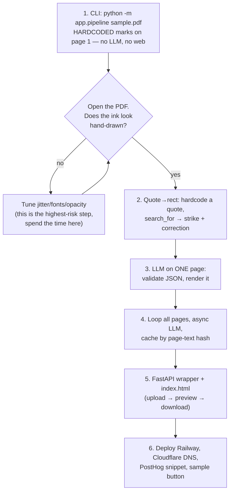

# Half-Blood Professor PDF — Build Spec

## The problem, refined

Upload a textbook chapter (PDF). Get it back looking like the Half-Blood Prince's copy of
*Advanced Potion-Making*: an expert has scrawled all over it in ink — struck out the outdated
number and written the correct one above it, circled a weak claim with an arrow to a terse
margin note, underlined what actually matters, and scribbled out the paragraph that's just wrong.

The reference images define the visual vocabulary exactly (see `references/`):

| Mark | Reference example | What it communicates |
|------|-------------------|----------------------|
| Strike + correction | "12" crossed out, "13" written below | *This fact is outdated, here's the fix* — **the money shot** |
| Circle + arrow + margin note | "Cut up" circled → "Crush with blade, releases juice better" | *There's a better way* |
| Wavy underline (single/double) | Key phrases underlined | *This matters, remember it* |
| Margin scrawl (sometimes rotated 90°) | Dense cursive in margins | Expert commentary, study tips |
| Cross-hatch scribble block | Whole paragraph blotted out | *Ignore this entirely* |
| Asterisks / stars / small symbols | Scattered doodles | Emphasis, personality |

**The 30-second demo (what judges see):** click "Try sample chapter" → progress line
("Reading… Thinking… Scribbling…") → annotated PDF appears in the page with visible ink marks →
download button. One upload of their own PDF works too.

## Scope

### In (MVP — buildable in 2–3 h)

- Digital-text PDFs only, **≤ 15 pages, ≤ 10 MB**. Friendly rejection otherwise.
- The six marks above, rendered as hand-jittered vector ink (no image generation).
- One LLM call **per page** (JSON mode, capped output), pages processed concurrently.
- Handwriting font for all notes (embedded TTF).
- Inline PDF preview + download. Bundled sample chapter button.
- Disclaimer line: "Annotations are AI-generated and may be wrong. Upload only content you may use."
- PostHog: `pdf_uploaded`, `pdf_annotated`, `error_occurred`.

### Out (cut, with re-add triggers)

| Cut | Why | Add when |
|-----|-----|----------|
| OCR / scanned PDFs | pytesseract + pdf2image is a rabbit hole; demo PDFs are digital | Real users demand it |
| Convex / job queue / polling | 15 pages processes in ~15–30 s; a sync request survives that | Docs > 30 pages or real concurrency |
| Next.js / React | One static HTML page covers upload + preview | The UI grows real state |
| Mind-map / image generation | Jittered vector doodles already sell the aesthetic | Post-hackathon polish |
| Real web-search fact-checking | LLM prior knowledge + hedged phrasing is demo-honest | Accuracy matters more than vibes |
| Theme personas dropdown | One voice ("Half-Blood Professor") is stronger | It's a 5-min string swap later |
| Accounts, history, storage | Process in memory, return bytes, store nothing | Never, ideally |

## Stack

| Layer | Choice | Why (ponytail ladder) |
|-------|--------|----------------------|
| Everything server | **FastAPI**, one service | Serves the static page AND the pipeline; no second deploy |
| PDF read + draw | **PyMuPDF (`fitz`)** | `page.search_for(quote)` = quote→coordinates in one call; draws lines, beziers, ovals, rotated text, embeds TTF. One library does the whole deterministic layer |
| LLM | OpenAI API (your GPT credits), small model, JSON mode | Only non-deterministic step; ~pennies per doc |
| Frontend | One `static/index.html`, vanilla JS | Drag-drop + `fetch` + `<embed>` preview needs no framework |
| Fonts | Google Fonts OFL: **Caveat** (notes), **Homemade Apple** (big corrections) | Free to embed, genuinely handwritten look |
| Analytics | PostHog JS snippet | One `<script>` tag, three events |
| Hosting | **Railway** (or Render) + Cloudflare DNS/CDN in front | ⚠ Cloudflare Workers **cannot run PyMuPDF** (native wheel). Python needs a real host; Cloudflare still fronts the domain. If Workers-only is non-negotiable, the alternative is a full-JS rewrite (pdf.js + pdf-lib in the browser) — more code, skip for the hackathon |

Cut from the original plan: Convex (no state exists to store), Node backend, Higgsfield site
(optional: use it only to generate a pretty landing *page design*, not the app).

## Architecture

```
Browser ──POST /annotate (PDF bytes)──▶ FastAPI
                                          │ 1. fitz: extract text per page (reject if empty → "scanned PDFs unsupported")
                                          │ 2. per page (async, 5 at a time): LLM → JSON annotations
                                          │ 3. per annotation: page.search_for(quote) → rects  (no match → drop silently)
                                          │ 4. scribe: draw jittered ink at rects
                                          ▼
Browser ◀──application/pdf bytes──── annotated PDF (never touches disk)
```

**Determinism policy:** the LLM decides only *what* to mark and *what the note says*.
Extraction, quote→coordinate mapping, placement, jitter, and drawing are pure Python.
Jitter RNG is seeded with `sha256(pdf_bytes)` — same upload, identical output — and LLM
responses are cached by `sha256(page_text)`, so demo re-runs cost zero tokens.

## LLM contract

One call per page. System prompt: terse, confident, slightly caustic expert
("Obviously outdated — Göbekli Tepe, ~9500 BCE"). Strict JSON out:

```json
{
  "annotations": [
    {"type": "underline", "quote": "exact substring from the page", "note": "margin note ≤ 12 words"},
    {"type": "strike",    "quote": "the outdated phrase",           "correction": "≤ 6 words", "note": "optional why"},
    {"type": "circle",    "quote": "weak claim",                    "note": "margin note; arrow drawn to it"},
    {"type": "scribble",  "quote": "opening words of bad paragraph","note": "dismissive margin comment"},
    {"type": "doodle",    "quote": "anchor text",                   "symbol": "star | asterisk | exclaim"}
  ]
}
```

Prompt rules that keep the deterministic side safe:
- Quotes must be **verbatim substrings, ≤ 10 words** (short quotes match reliably; `search_for`
  handles line-wrapped matches by returning multiple rects — mark each).
- **≤ 6 annotations per page** (references are denser, but density multiplies failure modes).
- At least one strike-with-correction per document when any claim is dated — it's the demo.
- Normalize both extracted text and quotes (NFKC, collapse whitespace) before matching.

## Rendering spec (`scribe.py` — this is the product)

All ink: near-black sepia `#241f1a`, stroke ~1.2 pt, opacity 0.85–0.95 (varied per stroke).

- **Wavy line** (underline/strike): sample points every ~12 pt along the baseline, jitter y by
  ±0.8 pt, connect with quadratic beziers. Double-underline = two passes, different jitter.
- **Strike + correction**: wavy line through the quote rect's vertical center; correction text
  in Homemade Apple just above the rect (below if no headroom), sized to ~90% of struck text height.
- **Circle**: two overlapping imperfect ellipses around the quote rect inflated by 4 pt
  (two passes ≈ hand-drawn). **Arrow**: slight-curve bezier from circle edge to the margin
  note, small open arrowhead.
- **Margin notes**: pick the wider margin (left/right); wrap to margin width; place at quote's
  y, then greedy push-down to avoid overlapping earlier notes; rotate each note −3°…+3°;
  Caveat at 9–11 pt, size varied per note.
- **Scribble block**: 3 passes of tight zigzag polylines across the paragraph's rects.
- **Doodles**: tiny hardcoded stroke paths (star, asterisk, exclamation) stamped near the anchor
  with jittered scale/rotation.

`# ponytail:` margin placement is greedy push-down, no global layout solver — collisions on
note-heavy pages just stack downward; add a proper packer only if pages ever look broken.

## File layout

```
app/
  main.py        # FastAPI: GET / (static), POST /annotate
  pipeline.py    # extract → LLM (async per page) → match quotes → call scribe
  scribe.py      # ink primitives (wavy line, circle, arrow, margin text, scribble, doodles)
  prompts.py     # system + page prompt, JSON schema
  fonts/         # Caveat-Regular.ttf, HomemadeApple-Regular.ttf
  static/index.html
samples/chapter.pdf
tests/test_scribe.py   # smoke: annotate sample page 1 with one of each mark, assert output opens & has drawings
```

## Build order (test the look first — it IS the product)



Phases 1–2 need no API key and de-risk the entire demo. If time runs out after phase 3,
a one-page demo still wins.

## Risks & edge cases

| Risk | Mitigation |
|------|-----------|
| Quote doesn't match (hyphenation, ligatures, LLM paraphrased) | NFKC-normalize both sides; require ≤ 10-word quotes; drop unmatched silently — a missing doodle is invisible, a misplaced one is broken. **Hit in practice:** the MLSysBook PDF maps fi/fl/ffi/ff to CJK codepoints (`昀椀`…); `pipeline.py` retries each search with a ligature-substituted quote. Hyphen-wrapped words (`opti-mize`) still fail — prompt the LLM to avoid quotes starting/ending mid-hyphenation, and prefer 3–6 word quotes |
| Scanned/image PDF | Text extraction comes back empty → reject with "works on digital-text PDFs" message. No OCR |
| Host request timeout | 15 pages ≈ 15–30 s with 5-way concurrency; Railway/Render allow it. (Another reason Workers is out — 30 s CPU cap) |
| LLM returns broken JSON | JSON mode + one retry, then skip that page — other pages still render |
| Hallucinated "corrections" | Disclaimer in UI; prompt favors hedged phrasing ("recent digs suggest…"); brand as study companion, not fact-checker |
| Copyright | Nothing stored, nothing public, in-memory only; "upload only content you may use" line |
| Noisy/ugly pages | ≤ 6 annotations/page cap; margin push-down; seeded RNG makes any bad page reproducible → debuggable |
| Cost | ~15 calls × ~2k in / 700 out tokens ≈ pennies per doc; page-hash cache makes repeats free; 15-page hard cap |
